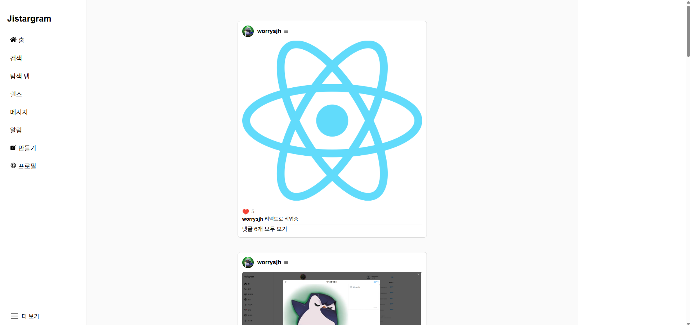
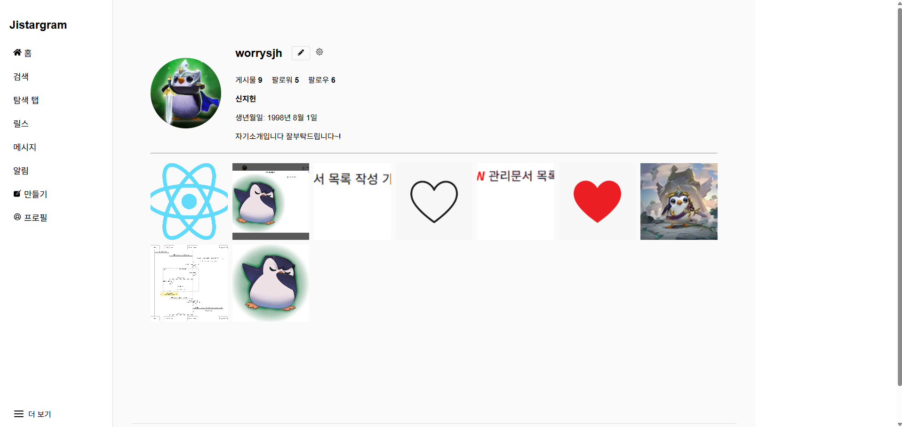

# 🌐 Jistargram

## 🛠️ 프로젝트 개요

> 인스타그램 스타일의 SNS 웹 애플리케이션을 React, Express.js, PostgreSQL을 기반으로 개발합니다.  
> 회원가입/로그인, 게시글 업로드, 피드 조회, 댓글, 좋아요 기능을 제공합니다.

---

## 🚀 주요 기능

- ***

## 코드 리뷰

# 1차 리뷰

- **Server**

  - Controller / services 로직 분리
  - app.js에 pool 확인해 연결여부 체크
  - Upload는 기능 / multer는 middleware

- **Client**

  - bcrypt 중 secret 없음

- **DataBase**

  - users Table : userid / username 구분

- **etc.**
  - 함수같은 파일명 변경(Form 등)
  - 최상단 코드는 무조건 간단하게
  - 로그인시 정규식 추가
  - vh 회피
  - 삭제 회피 (상태 변경)
  - 명명 규칙

# 2차 리뷰

---

## ✅ 기능 명세

| 구현여부 | 구분        | 기능명             | 설명                                           | 비고                      |
| :------- | :---------- | :----------------- | :--------------------------------------------- | :------------------------ |
| ✅       | 회원 기능   | 회원가입           | 이메일, 비밀번호, 닉네임을 입력하여 회원가입   | 비밀번호 bcrypt 해싱 저장 |
| ✅       | 회원 기능   | 로그인             | 이메일, 비밀번호 입력 후 JWT 발급              | Access Token 반환         |
| ✅       | 회원 기능   | 프로필 조회        | 자신의 닉네임, 프로필 이미지 조회 및 수정/탈퇴 | 보호된 API                |
| ❌       | 회원 기능   | 키워드 검색        | 특정 키워드를 통한 게시글 검색                 |                           |
| ✅       | 게시글 기능 | 게시글 업로드      | 이미지 + 캡션 입력하여 게시글 등록             | 로그인 필요               |
| ✅       | 게시글 기능 | 게시글 관리        | 자신의 게시글의 내용, 댓글에 대한 수정/삭제    | 로그인 필요               |
| ✅       | 게시글 기능 | 게시글 목록 조회   | 메인 페이지에서 전체 게시글 조회 (최신순 정렬) | 무한 스크롤 (선택사항)    |
| ✅       | 게시글 기능 | 게시글 상세 조회   | 특정 게시글의 상세 정보, 댓글 목록 표시        |                           |
| ✅       | 댓글 기능   | 댓글 작성          | 게시글에 댓글 작성 가능                        | 로그인 필요               |
| ✅       | 댓글 기능   | 댓글 삭제          | 기존 댓글의 내용 삭제 가능                     | 로그인 필요               |
| ✅       | 좋아요 기능 | 좋아요/좋아요 취소 | 게시글에 좋아요 토글 기능 제공                 | 로그인 필요               |
| ❌       | 인증 기능   | 인증 보호 라우트   | 로그인 사용자만 접근 가능한 페이지 제한        | JWT 인증 검사             |
| ❌       | 기타 기능   | 에러 처리          | 일관된 에러 코드 및 메시지 제공                | 400, 401, 404, 500 구분   |

---

## ✅ 비기능 명세

| 항목                  | 내용                                        |
| :-------------------- | :------------------------------------------ |
| API 통신 방식         | RESTful API (GET, POST, PUT, DELETE)        |
| 프론트엔드 프레임워크 | React.js (Create React App 기반)            |
| 백엔드 프레임워크     | Express.js (Node.js)                        |
| 인증 방식             | JWT (Json Web Token)                        |
| 비밀번호 보안         | bcrypt로 비밀번호 해싱                      |
| 데이터베이스          | PostgreSQL                                  |
| 요청/응답 포맷        | JSON                                        |
| 에러 핸들링           | 전역 에러 처리 미들웨어 구현                |
| CORS 정책             | 프론트엔드 도메인만 허용 설정               |
| 배포 계획             |                                             |
| UI 스타일링           | Tailwind CSS or DaisyUI 활용                |
| 반응형 지원           | 모바일 및 데스크탑 대응 (Responsive Design) |
| 성능 목표             |                                             |

---

## 🗂️ 프로젝트 구조 (수정중)

```
jistargram/
├── jistargram-client/     # React 프론트엔드
│   ├── public/
│   ├── src/
│   │   ├── actions/
│   │   │   ├── auth/
│   │   │   ├── layout/
│   │   │   ├── post/
│   │   │   └── profile/
│   │   ├── components/    # 공통 UI 컴포넌트 (Navbar, Logout 등)
│   │   │   ├── auth/
│   │   │   ├── layout/    # 페이지 공통 레이아웃 (Header, Footer, Outlet 등)
│   │   │   └── posts/     # 게시글 모달 컴포넌트
│   │   ├── pages/         # 주요 라우팅 페이지 컴포넌트
│   │   │   ├── LoginPage.js
│   │   │   ├── RegisterPage.js
│   │   │   ├── PostPage.js
│   │   │   ├── ProfilePage.js
│   │   │   └── ProfileChangePage.js
│   │   ├── utils/         # fetch 래퍼 등 유틸 함수
│   │   │   ├── authFetch.js
│   │   │   └── getUserFormToken.js
│   │   ├── App.js         # 라우터 설정 포함 메인 컴포넌트
│   │   └── index.js       # React 엔트리 포인트
│   └── package.json       # 프론트엔드 패키지 설정
│
├── jistargram-server/     # Express 백엔드
│   ├── public/
│   │   └── uploads/       # 업로드된 프로필 이미지 저장소
│   │       └── profile_imgs/
│   ├── routes/            # API 라우터 정의
│   │   ├── likeRoutes.js
│   │   ├── postRoutes.js
│   │   └── userRoutes.js
│   ├── middleware/        # 인증 관련 미들웨어
│   │   ├── auth.js
│   │   ├── uploadPostImage.js
│   │   ├── uploadProfileImage.js
│   │   └── verifyPasswd.js
│   ├── controllers/       # 비즈니스 로직
│   │   ├── likeController.js
│   │   ├── postController.js
│   │   └── userController.js
│   ├── services/          # 서비스 로직
│   │   ├── likeService/
│   │   ├── postService/
│   │   └── userService/
│   ├── models/            # PostgreSQL 연결 설정
│   │   └── db.js          # pool 관리
│   ├── app.js             # Express 서버 설정 진입점
│   └── package.json       # 백엔드 패키지 설정
│
├── README.md              # 프로젝트 설명 문서
└── .env                   # 환경변수 파일 (JWT_SECRET, DB 연결 등)
```

---

## DB 관계도

- **수정전**
  

- **수정후**
  

---

## 🖥️ 데모화면

# 1차 코드리뷰

- **로그인**
  

- **회원가입**
  

- **메인**

  - 수정 전
    
  - 수정 후
    

- **게시글**
  
  
  

- **프로필**

  - 수정 전
    
  - 수정 후
    

- **프로필수정**
  - 수정 전
    
  - 수정 후
    
    

---
