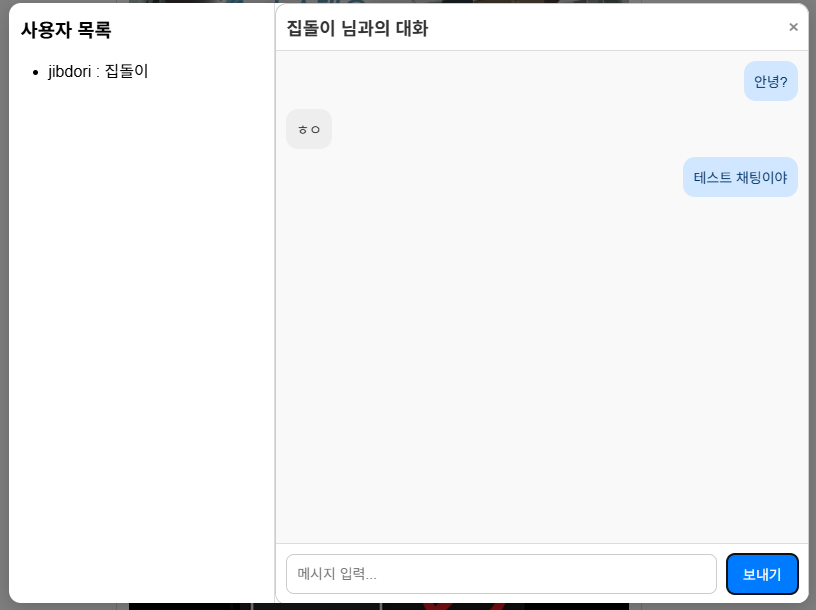

# 🌐 Jistargram

## 🛠️ 프로젝트 개요

> 인스타그램 스타일의 SNS 웹 애플리케이션을 React, Express.js, PostgreSQL을 기반으로 개발합니다.  
> 회원가입/로그인, 게시글 업로드, 피드 조회, 댓글, 좋아요 기능을 제공합니다.

---

## 🚀 배포 및 실행

> 1. git-hub에서 code clone
> 2. clone 받은 라이브러리에서
> 3. docker-compose up --build 실행
> 4. 웹 브라우저에서 192.168.120.206:3000 접속

---

## ✅ 기능 명세

| 구현여부 | 구분               | 기능명             | 설명                                           | 비고                                       |
| :------- | :----------------- | :----------------- | :--------------------------------------------- | :----------------------------------------- |
| ✅       | 회원 기능          | 회원가입           | 이메일, 비밀번호, 닉네임을 입력하여 회원가입   | 비밀번호 bcrypt 해싱 저장                  |
| ✅       | 회원 기능          | 로그인             | 이메일, 비밀번호 입력 후 JWT 발급              | Access Token 반환                          |
| ❌       | 회원 기능          | 비밀번호 찾기      |                                                |                                            |
| ✅       | 회원 기능          | 프로필 조회        | 자신의 닉네임, 프로필 이미지 조회 및 수정/탈퇴 | 보호된 API                                 |
| ❌       | 회원 기능          | 키워드 검색        | 특정 키워드를 통한 게시글 검색                 |                                            |
| ✅       | 게시글 기능        | 게시글 업로드      | 이미지 + 캡션 입력하여 게시글 등록             | 로그인 필요                                |
| ✅       | 게시글 기능        | 게시글 관리        | 자신의 게시글의 내용, 댓글에 대한 수정/삭제    | 로그인 필요                                |
| ✅       | 게시글 기능        | 게시글 목록 조회   | 메인 페이지에서 전체 게시글 조회 (최신순 정렬) | 무한 스크롤 (선택사항)                     |
| ✅       | 게시글 기능        | 게시글 상세 조회   | 특정 게시글의 상세 정보, 댓글 목록 표시        |                                            |
| ✅       | 댓글 기능          | 댓글 작성          | 게시글에 댓글 작성 가능                        | 로그인 필요                                |
| ✅       | 댓글 기능          | 댓글 삭제          | 기존 댓글의 내용 삭제 가능                     | 로그인 필요                                |
| ✅       | 답글 기능          | 답글 작성          | 기존 댓글의 답글 내용 작성 가능                | 로그인 필요                                |
| ✅       | 게시글 좋아요 기능 | 좋아요/좋아요 취소 | 게시글에 좋아요 토글 기능 제공                 | 로그인 필요                                |
| ✅       | 댓글 좋아요 기능   | 좋아요/좋아요 취소 | 댓글에 좋아요 토글 기능 제공                   | 로그인 필요                                |
| ✅       | 인증 기능          | 로그아웃           | 서버와 클라이언트 쿠키/토큰 제거               | refresh token 무효화 및 쿠키 제거          |
| ✅       | 인증 기능          | 인증 보호 라우트   | 로그인 사용자만 접근 가능한 페이지 제한        | JWT 인증 검사                              |
| ✅       | 인증 기능          | 토큰 암호화        | JWT를 AES-256으로 암호화                       |                                            |
| ✅       | 인증 기능          | 토큰 자동 갱신     | refresh token을 통한 자동 갱신                 | refresh token 검사 후 new access token발급 |
| ✅       | 기타 기능          | 에러 처리          | 일관된 에러 코드 및 메시지 제공                | 400, 401, 404, 500 구분                    |
| ✅       | 채팅 기능          | 사용자 조회        | 가입된 모든 사용자에 대해 조회 기능 제공       |                                            |
| ✅       | 채팅 기능          | 실시간 채팅        | Socket.io를 통한 실시간 전송 및 수신           | socket io 사용                             |
| ✅       | 채팅 기능          | 이전 대화 불러오기 | 저장된 메시지 이력 조회                        | PostgreSQL messages 테이블                 |

---

## ✅ 비기능 명세

| 항목                  | 내용                                        |
| :-------------------- | :------------------------------------------ |
| API 통신 방식         | RESTful API (GET, POST, PUT, DELETE)        |
| 프론트엔드 프레임워크 | React.js (Create React App 기반)            |
| 백엔드 프레임워크     | Express.js (Node.js) + Socket.IO            |
| 인증 방식             | JWT (Json Web Token)                        |
| 비밀번호 보안         | bcrypt로 비밀번호 해싱                      |
| 데이터베이스          | PostgreSQL                                  |
| 요청/응답 포맷        | JSON                                        |
| 에러 핸들링           | 전역 에러 처리 미들웨어 구현                |
| CORS 정책             | 프론트엔드 도메인만 허용 설정               |
| 배포 계획             | DOCKER COMPOSE                              |
| UI 스타일링           | Grid, MediaQuery 등                         |
| 반응형 지원           | 모바일 및 데스크탑 대응 (Responsive Design) |
| 성능 목표             |                                             |

---

## 🗂️ 프로젝트 구조 (수정중)

```
jistargram/
├── jistargram-client/     # React 프론트엔드
│   ├── public/
│   ├── src/
│   │   ├── actions/
│   │   │   ├── auth/
│   │   │   ├── comment/
│   │   │   ├── post/
│   │   │   └── profile/
│   │   ├── components/    # 공통 UI 컴포넌트 (Navbar, Logout 등)
│   │   │   ├── auth/
│   │   │   ├── common/    # 좋아요 UI 컴포넌트
│   │   │   ├── layout/    # 페이지 공통 레이아웃 (Header, Footer, Outlet 등)
│   │   │   ├── messages/  # 채팅 화면면 레이아웃
│   │   │   └── posts/     # 게시글 모달 컴포넌트
│   │   ├── pages/         # 주요 라우팅 페이지 컴포넌트
│   │   │   ├── LoginPage.js
│   │   │   ├── RegisterPage.js
│   │   │   ├── PostPage.js
│   │   │   ├── ProfilePage.js
│   │   │   └── ProfileChangePage.js
│   │   ├── styles/
│   │   ├── utils/         # fetch 래퍼 등 유틸 함수
│   │   │   ├── authFetch.js
│   │   │   ├── commentUtils.js
│   │   │   └── socket.js  # 단일 소캣 인스턴스 관리
│   │   ├── App.js         # 라우터 설정 포함 메인 컴포넌트
│   │   └── index.js       # React 엔트리 포인트
│   └── package.json       # 프론트엔드 패키지 설정
│
├── jistargram-server/     # Express 백엔드
│   ├── public/
│   │   └── uploads/       # 업로드된 프로필 이미지 저장소
│   │       └── profile_imgs/
│   ├── sql
│   │   └── init.sql       # 배포용 초기 DB 테이블 생성쿼리리
│   ├── src
│   │   ├── controllers/       # 비즈니스 로직
│   │   │   ├── authController.js
│   │   │   ├── likeController.js
│   │   │   ├── messageController.js
│   │   │   ├── postController.js
│   │   │   └── userController.js
│   │   ├── middleware/        # 인증 관련 미들웨어
│   │   │   ├── auth.js
│   │   │   ├── uploadPostImage.js
│   │   │   ├── uploadProfileImage.js
│   │   │   └── verifyPasswd.js
│   │   ├── models/            # PostgreSQL 연결 설정
│   │   │   └── db.js          # pool 관리
│   │   ├── routes/            # API 라우터 정의
│   │   │   ├── authRoutes.js
│   │   │   ├── likeRoutes.js
│   │   │   ├── messageRoutes.js
│   │   │   ├── postRoutes.js
│   │   │   └── userRoutes.js
│   │   ├── services/          # 서비스 로직
│   │   │   ├── postService/
│   │   │   │   ├── comment.service.js
│   │   │   │   └── post.service.js
│   │   │   ├── auth.service.js
│   │   │   ├── like.service.js
│   │   │   ├── message.service.js
│   │   │   └── user.service.js
│   │   └── utils/             # 암호화/복호화 로직
│   │       └── cryptoUtils.js
│   ├── app.js             # router 연결 관리
│   ├── index.js           # socket.io 및 db connection 연결시도 (진입점)
│   └── package.json       # 백엔드 패키지 설정
│
├── README.md              # 프로젝트 설명 문서
└── .env                   # 환경변수 파일 (JWT_SECRET, DB 연결 등)
```

---

## DB 관계도


---

## 🖥️ 데모화면

- **로그인**
  

- **회원가입**
  

- **메인**
  

- **게시글**
  
  
  

- **검색**
  
  

- **프로필**
  
  

- **프로필수정**
  
  

- **채팅**
  
  

---
